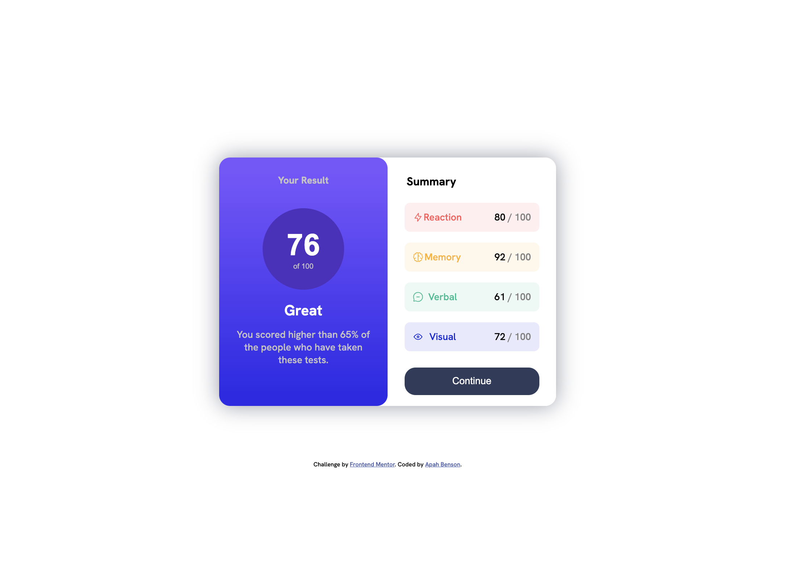

# Frontend Mentor - Results summary component solution

This is a solution to the [Results summary component challenge on Frontend Mentor](https://www.frontendmentor.io/challenges/results-summary-component-CE_K6s0maV). Frontend Mentor challenges help you improve your coding skills by building realistic projects.

## Table of contents

- [Overview](#overview)
  - [The challenge](#the-challenge)
  - [Screenshot](#screenshot)
  - [Links](#links)
- [My process](#my-process)
  - [Built with](#built-with)
  - [What I learned](#what-i-learned)
  - [Continued development](#continued-development)
- [Author](#author)

## Overview

### The challenge

Users should be able to:

- View the optimal layout for the interface depending on their device's screen size
- See hover and focus states for all interactive elements on the page

### Screenshot



### Links

- Solution URL: [Add solution URL here](https://github.com/apah-dev/results-summary-component-main.git)
- Live Site URL: [Add live site URL here](https://apah-dev.github.io/results-summary-component-main/)

## My process

### Built with

- Semantic HTML5 markup
- CSS custom properties
- Flexbox
- Media Query

### What I learned

Used spans to target specific areas of paragraphs and headings
Used Media Query to properly specify the dimension/view for mobile for a more responsive layout

```html
<div class="visual">
  Visual
  <span id="percentage"> 72 <span id="hundred"> / 100 </span></span>
</div>
```

```css
      @media (max-width: 600px) {
        main {
          flex-direction: column;
          padding: 0;
          margin: 0;
          width: 100%;
          margin-top: -20px;
        }
```

### Continued development

I intend to further understand when to use flexbox for the body or the main content and also to be able to fully take control of the background-image to great gradients

## Author

- Frontend Mentor - [@apah-dev](https://www.frontendmentor.io/profile/apah-dev)
- Twitter - [@benson_apah](https://www.twitter.com/benson_apah)
